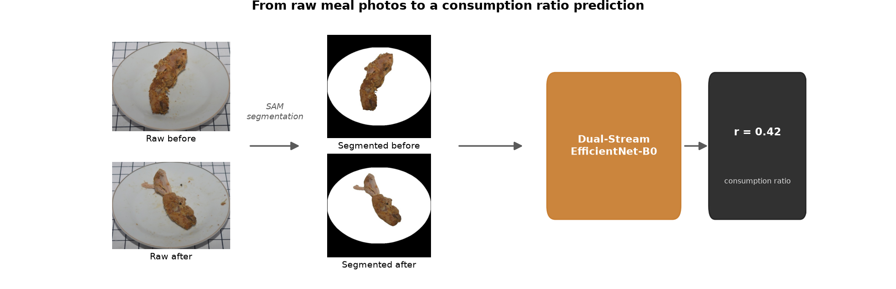
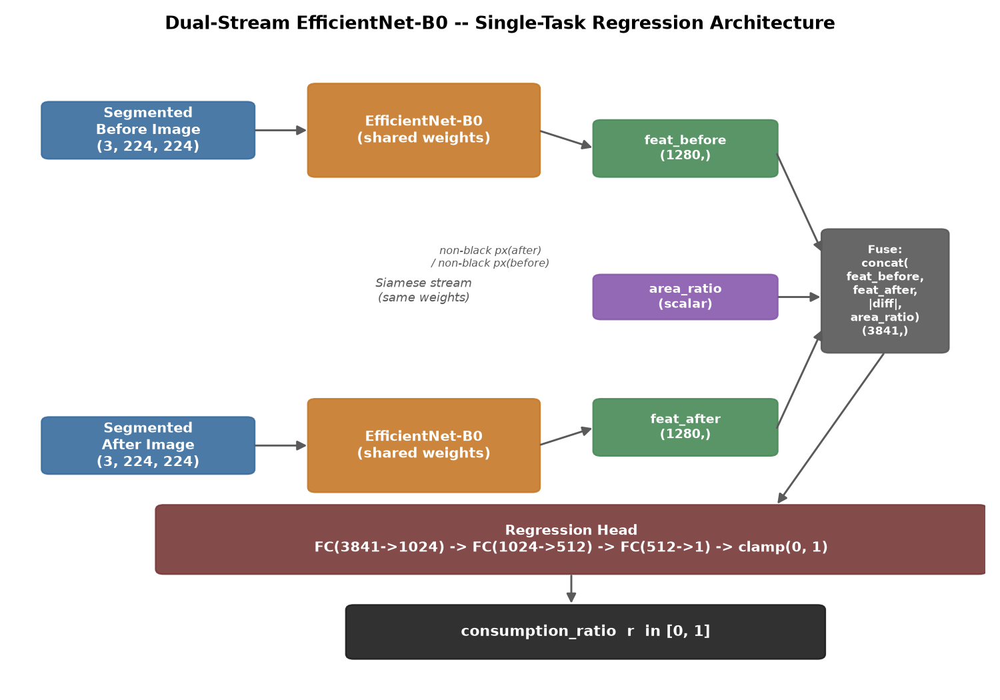
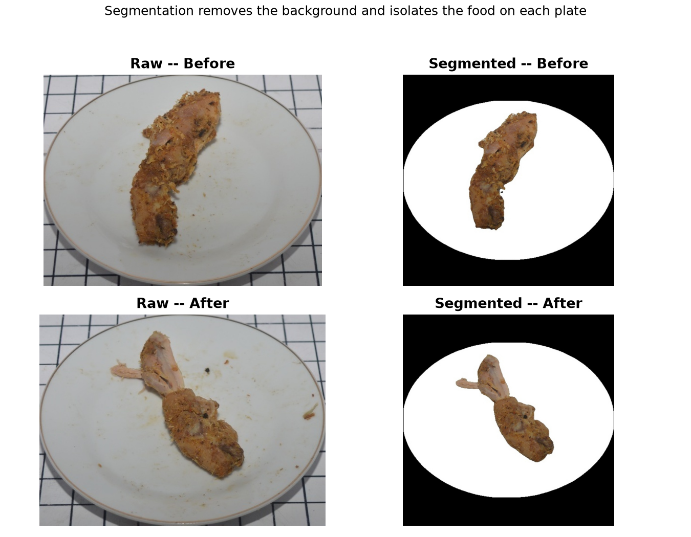
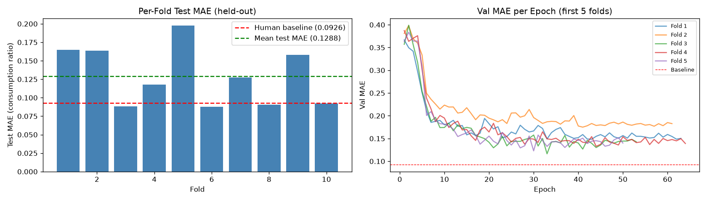

# Food Waste Estimation -- Dual-Stream CNN with EfficientNet-B0

Single-task deep learning system that estimates food consumption ratio from before/after meal image pairs, then denormalizes to grams. Reproduces and extends the methodology from:

> **Automated Food Leftover Estimation Using Deep Learning**
> https://doi.org/10.1371/journal.pone.0320426

Dataset: **LeFoodSet** -- 524 usable samples across 34 food categories (678 rows in Excel; 154 lack segmented images and are skipped automatically).

<p align="center">
  
</p>

---

## Overview

Given a pair of segmented images (before and after a meal), the model predicts:

- **Consumption ratio** `r = w_after / w_before` in [0, 1] (primary output, regression)
- **Weight after eating** in grams (optional, requires known serving weight)

Target: beat the human visual observer baseline of **MAE = 0.0926** on the consumption ratio scale.

---

## Architecture

Single-task dual-stream EfficientNet-B0 with enhanced fusion. Both streams share EfficientNet-B0 weights (Siamese-style).

<p align="center">
  
</p>

The backbone trains from random initialization by default (`--no-pretrained`); pass `--pretrained` to fine-tune from ImageNet weights instead, in which case the backbone is frozen for the first 10 epochs then fully unfrozen (LR reset to initial value on unfreeze). The frozen warm-up is skipped automatically when training from scratch.

**area_ratio**: non-black pixel count of after image / before image -- gives the model an explicit visual coverage signal.

**Loss**: `HuberLoss(delta=0.1)`
**Optimizer**: Adam, lr=0.0001
**Denormalize**: `w_after_hat = r_hat * w_before`

---

## Project Structure

```
ml-food-waste-estimation/
├── CLAUDE.md                       # Agent instructions and project rules
├── SPEC.md                         # Detailed technical specification
├── data/
│   ├── data_original.xlsx          # Metadata: filenames, weights, visual scores
│   ├── raw/
│   │   ├── data_before/            # Raw before-eating images (by food category)
│   │   └── data_after/             # Raw after-eating images (by food category)
│   └── segmented/
│       ├── data_before/            # Segmented before images (black background)
│       └── data_after/             # Segmented after images (black background)
├── notebooks/
│   ├── LeFoodSet_Leftovers_EDA.ipynb
│   ├── LeFoodSet_Leftovers_Training.ipynb    # Full training pipeline (local + Colab)
│   └── LeFoodSet_Leftovers_Inference.ipynb   # Demo: load image pair and predict
├── src/
│   ├── dataset.py                  # FoodWasteDataset, area_ratio, transforms
│   ├── model.py                    # DualStreamEfficientNet (single-task)
│   ├── train.py                    # 10-fold outer + 5-fold inner GroupKFold training loop
│   ├── inference.py                # CLI inference script
│   ├── segmentation.py             # Raw image -> segmented image (SAM-based)
│   └── utils.py                    # Metrics, seed fixing
├── checkpoints/                    # Best model per fold
└── results/                        # Metrics, logs, training curves
```

---

## Dataset

| Property | Value |
|---|---|
| Samples | 524 usable (678 in Excel, 154 skipped -- no segmented images) |
| Categories | 34 Indonesian foods |
| Input | Segmented images (black background, `data/segmented/`) |
| Metadata | `data/data_original.xlsx` |
| Label | `consumption_ratio = Weight_After / Weight_Before`, clipped to [0, 1] |
| Resolution | ~500x400 or ~700x520, resized to 224x224 |

**Important**: Always use segmented images as input. Never use raw images.

The visual score column (1-7) in the metadata is a human observer rating and is **not** the training target.

### Sample pair

<p align="center">
  
</p>

---

## Setup

### Local (uv)

[uv](https://docs.astral.sh/uv/) is the package manager for local development.

```bash
# Install all dependencies into a managed virtual environment
uv sync

# Run scripts inside the environment
uv run python src/train.py --folds 10 --epochs 100 --lr 0.0001 --batch_size 16
```

### Google Colab

The entire project folder is stored on Google Drive. Before running any code, mount Drive, set the working directory, and install dependencies with pip:

```python
from google.colab import drive
drive.mount('/content/drive')

import os
os.chdir('/content/drive/MyDrive/ml-food-waste-estimation')  # adjust to your folder name

!pip install -r requirements.txt
```

After that, all relative paths (`data/`, `checkpoints/`, `results/`, `src/`) resolve correctly, and checkpoints are automatically persisted to Drive.

---

## Segmentation

Raw photos must be converted to the segmented format (black background, white plate, food at original colors) before training or inference. Ground-truth segmented images are already provided under `data/segmented/`; this step is only needed for new raw images.

```bash
# Single image
uv run python src/segmentation.py --input data/raw/data_before/001/001_001_DSC_0059_bef.JPG --output results/seg_test.jpg

# Batch (walks subdirectories, writes flat into output_dir)
uv run python src/segmentation.py --input_dir data/raw/data_before --output_dir data/segmented/data_before
```

Uses SAM (Segment Anything, ViT-B) with point prompts to detect the plate, then classifies pixels inside the mask as plate surface (white) or food (original color) using HSV + local texture. See `SPEC.md` section 6 for the full algorithm and known limitations.

---

## Training

Local (uv), trains from scratch by default:
```bash
uv run python src/train.py --folds 10 --epochs 100 --lr 0.0001 --batch_size 16
```

Colab:
```bash
python src/train.py --folds 10 --epochs 100 --lr 0.0001 --batch_size 16
```

Fine-tune from ImageNet-pretrained weights instead:
```bash
uv run python src/train.py --folds 10 --epochs 100 --lr 0.0001 --batch_size 16 --pretrained --frozen_epochs 10
```

Training details:
- 10-fold outer GroupKFold (gives 10% test split) + 5-fold inner (gives ~20% val), grouped by food category
- WeightedRandomSampler with inverse-frequency bin weights (bimodal distribution)
- ReduceLROnPlateau(factor=0.5, patience=5); with `--pretrained`, scheduler and LR reset when backbone unfreezes at epoch `frozen_epochs + 1`
- Early stopping: patience=20 epochs on val MAE
- Random seeds fixed at 42 for Python, NumPy, PyTorch, and CUDA
- Training from scratch (default) on only 524 samples is more overfitting-prone than fine-tuning; budget more epochs and watch validation MAE closely

Checkpoints are saved to `checkpoints/fold_{n}_best.pth` relative to the project root.

### Augmentation

Both streams receive the **same** random augmentation each sample:

| Transform | Probability |
|---|---|
| Random horizontal flip | 1/7 |
| Random vertical flip | 1/7 |
| Random rotation (+-15 deg) | 1/7 |
| Random padding | 1/7 |
| Gaussian blur | 1/7 |
| Random sharpness | 1/7 |
| Random contrast | 1/7 |

---

## Inference

Local (uv):
```bash
uv run python src/inference.py \
  --before path/to/before.jpg \
  --after  path/to/after.jpg \
  --checkpoint checkpoints/fold_1_best.pth
```

With optional serving weight for gram output:
```bash
uv run python src/inference.py \
  --before path/to/before.jpg \
  --after  path/to/after.jpg \
  --checkpoint checkpoints/fold_1_best.pth \
  --weight_before 250
```

Returns:
```json
{
  "consumption_ratio": 0.62,
  "area_ratio": 0.58,
  "weight_after_grams": 155.0,
  "leftover_grams": 95.0,
  "weight_before_grams": 250.0
}
```

Ensemble inference (all 10 folds, averaged) is available via `notebooks/LeFoodSet_Leftovers_Inference.ipynb`.

---

## Evaluation

| Metric | Target | Baseline |
|---|---|---|
| MAE (consumption ratio) | **< 0.0926** | Human observer: 0.0926 |
| RMSE (consumption ratio) | minimize | N/A |

Results are aggregated in `results/summary.json` after all folds complete.

<p align="center">
  
</p>

*Example run shown above (`results/fold_mae.png`, regenerated each training run); your own numbers will differ.*

---

## Known Limitations

- **Rice / rice porridge**: white food on white plate degrades segmentation quality and confuses the model
- **Oily / saucy dishes**: residual oil is misclassified as food waste
- **Class imbalance**: Nasi ~78 samples, Tim ~76, most others 20-28

---

## Out of Scope

- Training a segmentation model (ground-truth segmented images are provided)
- Food category classification (single-task design)
- Web or mobile deployment
- Real-time video inference
- Foods outside the 34 LeFoodSet categories
